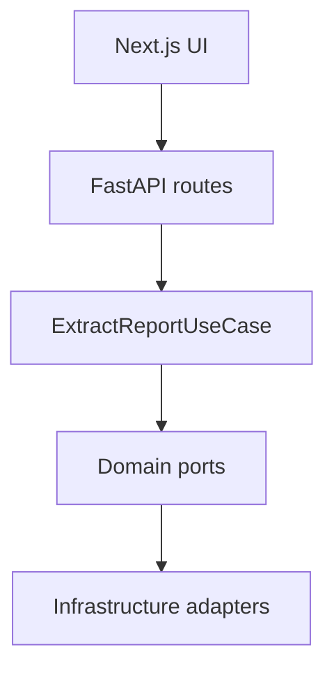
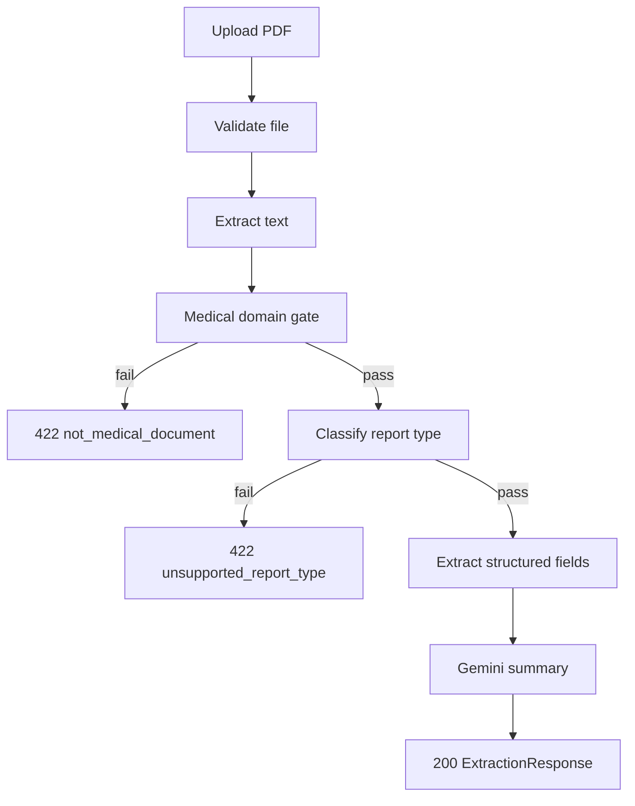

# Architecture — Smart Report Extractor

## Overview

Hexagonal (ports-and-adapters) layout. Business logic in `ExtractReportUseCase` depends only on domain protocols, not on FastAPI, PDF libraries, or Gemini.



## Request pipeline



Gemini runs only after successful classification and field extraction. Summary failure returns `summary: null` with warning `summary_unavailable`.

## Text extraction (Phase 2)

`ChainedPdfTextExtractor` implements the `TextExtractor` port:

1. **pdfplumber** — primary extraction
2. **PyMuPDF** — fallback if text is below `min_extracted_text_chars` (default 30)
3. **Tesseract OCR** — when digital extraction is insufficient and `ocr_enabled` is true
4. **Gemini vision OCR** — fallback when Tesseract is not installed (requires `GEMINI_API_KEY`)

Corrupt PDFs that fail PyMuPDF parsing raise `invalid_pdf`. Scanned documents without OCR available raise `text_extraction_failed`. When OCR is used, the API adds warning `ocr_used`.

## Classification and extraction (Phase 3)

Deterministic, no LLM involvement:

1. **Medical domain gate** — weighted vocabulary score; invoices and non-medical docs fail with `not_medical_document`
2. **Report classifier** — phrase + keyword rules per type; low confidence or ambiguous margin fails with `unsupported_report_type`
3. **Field extractors** — one module per report type, registered in `CompositeFieldExtractor`

## LLM summary (Phase 4)

`GeminiSummaryGenerator` receives only `report_type` and structured `extracted_data` JSON — never raw PDF text. If the API key is missing or Gemini fails after one retry, the extraction still succeeds with `summary: null` and warning `summary_unavailable`.

## Layer responsibilities

| Layer | Path | Responsibility |
|-------|------|----------------|
| API | `backend/app/api/` | HTTP, validation, error mapping |
| Application | `backend/app/application/` | Orchestration (`ExtractReportUseCase`) |
| Domain | `backend/app/domain/` | Models, ports, error codes |
| Infrastructure | `backend/app/infrastructure/` | PDF, OCR, classification, LLM, storage adapters |

## Ports (extension points)

| Port | V1 implementation | Future |
|------|-------------------|--------|
| `TextExtractor` | pdfplumber → PyMuPDF → OCR | Cloud OCR |
| `MedicalDomainGate` | Rule-based vocabulary score | — |
| `ReportClassifier` | Weighted keyword rules | ML classifier |
| `FieldExtractor` | Per-type extractors | Same interface |
| `SummaryGenerator` | Gemini on structured JSON | Fallback model |
| `BlobStorage` | In-memory | S3, GDrive, Azure Blob |
| `DocumentStore` | In-memory | PostgreSQL |

New ingestion sources (Google Drive, hospital repos) call the same `ExtractReportUseCase` after fetching bytes via `BlobStorage`.

## API contract

- `GET /api/v1/health` — service status and supported report types
- `POST /api/v1/extract` — upload PDF, returns `ExtractionResponse`
- OpenAPI docs at `/api/docs`

### Error codes

| Code | HTTP | When |
|------|------|------|
| `invalid_pdf` | 400 | Corrupt or non-PDF |
| `file_too_large` | 413 | Exceeds size limit |
| `unsupported_media_type` | 415 | Not `application/pdf` |
| `text_extraction_failed` | 422 | No extractable text |
| `not_medical_document` | 422 | Domain gate failed |
| `unsupported_report_type` | 422 | No matching report type |

## Repository layout

```
api/                 # Vercel serverless entrypoint (re-exports FastAPI app)
backend/app/         # Python API and business logic
frontend/src/        # Next.js UI
backend/tests/       # Pytest (fixtures gitignored)
docker-compose.yml   # Local full stack
vercel.json          # Deployment routing
```

## Deployment notes

- **Docker** — full stack including Tesseract for OCR.
- **Vercel** — digital PDF extraction only; OCR excluded from serverless bundle.
- **Fixtures** — never committed or deployed; used locally for extractor development.
